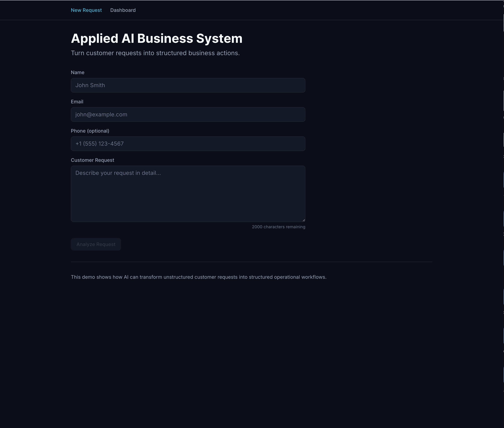
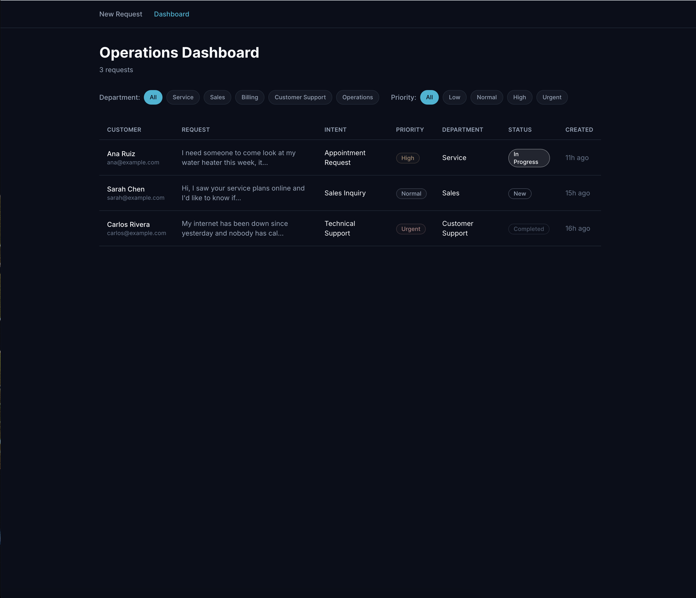
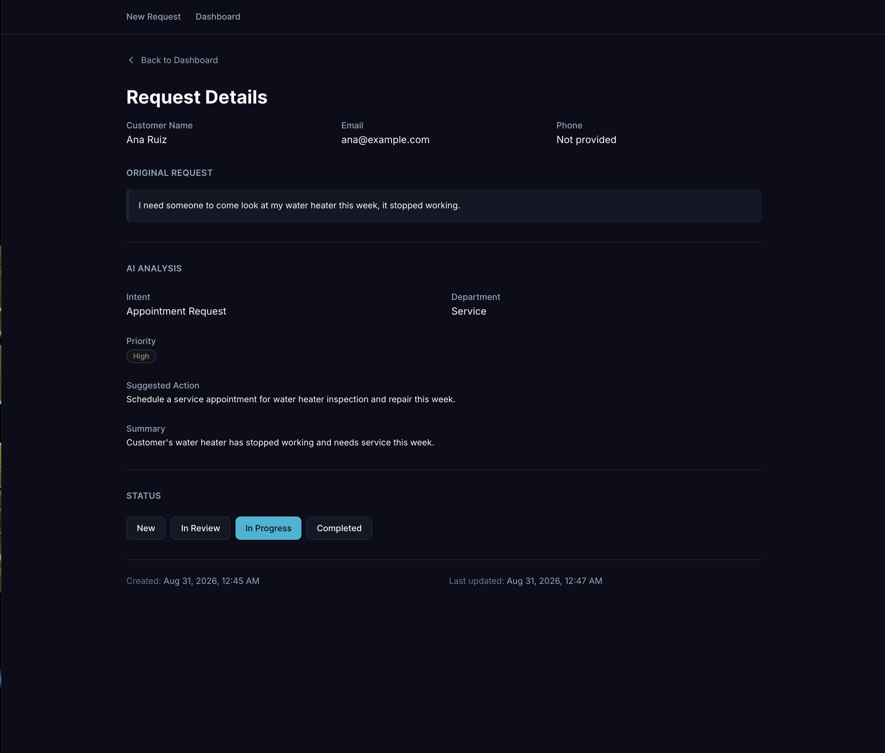

# Applied AI Business System

A reference implementation demonstrating how AI transforms unstructured customer requests into structured business workflows.

**Live Demo:** [https://applied-ai-business-system.vercel.app](https://applied-ai-business-system.vercel.app)

---

## Overview

This system accepts free-form customer requests through a web form and uses Claude AI to analyze and classify them into structured operational data. Each request is automatically categorized by intent, priority, and department, with a suggested action and executive summary generated for the operations team.

The project demonstrates production-grade architecture for integrating AI into business systems: server-side API calls, validated structured output, database persistence, rate limiting, and a complete operations dashboard. The AI is one focused component inside a conventional web application, not an autonomous agent or chatbot. It classifies inputs according to a fixed schema and returns control to the application immediately.

---

## The Business Problem

Businesses receive customer requests through forms, email, messages, and phone calls. Those requests arrive unstructured. An employee has to read each one and decide what the customer needs, how urgent it is, who should handle it, and what happens next.

This is repetitive work. The routing decision is straightforward but time-consuming. Different employees classify the same request differently, leading to inconsistent handling. High-priority requests can be missed if they are not phrased as urgent. The process does not scale.

See [docs/business-problem.md](./docs/business-problem.md) for an in-depth analysis.

---

## The Solution

An AI analysis layer converts an unstructured request into structured operational data:

- **Intent:** What the customer wants (Appointment Request, Technical Support, Sales Inquiry, Billing Question, General Inquiry, Complaint, Follow-Up)
- **Priority:** How urgent it is (Low, Normal, High, Urgent)
- **Department:** Who should handle it (Service, Sales, Billing, Customer Support, Operations)
- **Suggested Action:** What the business should do next (one sentence)
- **Summary:** A concise description of the request (1-3 sentences)

The AI classifies. The system stores, displays, and manages the workflow. The AI is one component inside a well-designed system, not the product itself.

---

## How It Works

1. Customer submits a request through a web form with name, email, optional phone number, and a free-form message (10-2000 characters).

2. Client-side validation runs before submission using Zod schemas.

3. The browser POSTs to `/api/analyze`. The Next.js API route applies rate limiting (5 requests per minute per IP).

4. The server calls Claude API with a classification system prompt. The model returns structured JSON.

5. The server validates the AI output against Zod schemas. If validation fails, the system retries once. If it fails again, the user receives a clear error message.

6. The validated analysis is POSTed to `/api/requests`. The server validates both customer data and analysis data server-side, then inserts the request into Supabase.

7. The customer sees a result page showing the original unstructured message on the left and the structured classification on the right.

8. Operations teams access `/dashboard` to view all requests, filter by department, priority, or status, and click through to full details.

9. From the detail page, status can be updated (New → In Review → In Progress → Completed) with optimistic UI updates and error recovery.

---

## Architecture

```
┌─────────────────────────────────────────────────────────────────┐
│                         Browser (Client)                        │
│  • Intake form with validation                                  │
│  • Analysis result display                                      │
│  • Operations dashboard with filters                            │
│  • Request detail view with status control                      │
└────────────┬────────────────────────────────────────────────────┘
             │
             │ HTTPS only
             │ No direct API access
             │ No secrets
             │
┌────────────▼────────────────────────────────────────────────────┐
│                    Next.js Server (Vercel)                      │
│                                                                  │
│  API Routes:                                                    │
│  • POST /api/analyze         → Claude API                       │
│  • POST /api/requests        → Supabase                         │
│  • PATCH /api/requests/[id]  → Supabase                         │
│                                                                  │
│  Server Components:                                             │
│  • Dashboard page            → Supabase                         │
│  • Request detail page       → Supabase                         │
│                                                                  │
│  Rate Limiting:                                                 │
│  • 5 requests per minute per IP (in-memory)                     │
│                                                                  │
│  Validation:                                                    │
│  • All user input (Zod)                                         │
│  • All AI output (Zod)                                          │
└────────┬───────────────────────────────┬────────────────────────┘
         │                               │
         │ ANTHROPIC_API_KEY             │ SUPABASE_SERVICE_ROLE_KEY
         │ (server-only)                 │ (server-only)
         │                               │
┌────────▼────────────┐         ┌────────▼────────────────────────┐
│   Claude API        │         │   Supabase (PostgreSQL)         │
│   (Anthropic)       │         │   • customer_requests table     │
│                     │         │   • RLS enabled                 │
│   Model:            │         │   • No public policies          │
│   claude-haiku-4-5  │         │   • Service role only           │
└─────────────────────┘         └─────────────────────────────────┘
```

**The central architectural constraint:** The browser never touches Claude or the database.

All API calls to Claude and all database operations go through Next.js API routes. The browser only communicates with the Next.js server. API keys never leave the server. Client-side JavaScript cannot bypass validation or rate limits. Row-level security is enabled on Supabase with zero public policies. Even if credentials leaked, they would not grant database access without the service role key, which is server-only.

See [docs/architecture.md](./docs/architecture.md) for the full request lifecycle.

---

## Features

- **AI-powered request classification** into intent, priority, department, suggested action, and summary
- **Real-time validation** of user input and AI output using Zod schemas
- **Rate limiting** to prevent abuse (5 requests per minute per IP)
- **Server-side security** with all secrets isolated from the browser
- **Operations dashboard** with filtering by department, priority, and status
- **Request detail view** with full customer information and AI analysis
- **Status management** with optimistic updates and error recovery
- **Responsive design** with mobile-optimized table views (cards on mobile, table on desktop)
- **URL-based filtering** for shareable dashboard views
- **Relative and absolute time formatting** for created/updated timestamps
- **Empty states** with context-aware messaging
- **Production error handling** with 429, 422, 400, 500 responses
- **Retry logic** for AI validation failures (one retry, then fail gracefully)

---

## AI Classification

The system uses a three-layer enforcement model to ensure structured output:

### Layer 1: System Prompt

The model receives explicit instructions:
- Return ONLY raw JSON with no markdown fences
- Use exact enum values (listed in the prompt)
- Never invent information not present in the customer's message
- Classify priority based on explicit criteria (Urgent = safety/outages, High = time-sensitive/frustrated, Normal = standard, Low = no time pressure)

See [docs/ai-classification.md](./docs/ai-classification.md) for the full prompt strategy.

### Layer 2: Zod Validation

The server validates AI output before accepting it:

```typescript
{
  intent: enum([
    "Appointment Request",
    "Technical Support",
    "Sales Inquiry",
    "Billing Question",
    "General Inquiry",
    "Complaint",
    "Follow-Up"
  ]),
  priority: enum(["Low", "Normal", "High", "Urgent"]),
  department: enum([
    "Service",
    "Sales",
    "Billing",
    "Customer Support",
    "Operations"
  ]),
  suggestedAction: string().min(1).max(300),
  summary: string().min(1).max(500)
}
```

If validation fails, the system retries once. If it fails again, the user receives an error message and no partial data is stored.

### Layer 3: Database Constraints

The PostgreSQL schema enforces:
- `intent TEXT NOT NULL CHECK (intent IN ('Appointment Request', ...))`
- `priority TEXT NOT NULL CHECK (priority IN ('Low', 'Normal', 'High', 'Urgent'))`
- `department TEXT NOT NULL CHECK (department IN ('Service', 'Sales', ...))`
- `suggested_action TEXT NOT NULL CHECK (LENGTH(suggested_action) <= 300)`
- `summary TEXT NOT NULL CHECK (LENGTH(summary) <= 500)`

Even if application-level validation is bypassed, the database will reject invalid data.

---

## Technology Stack

| Technology | Purpose | Why This Choice |
|------------|---------|-----------------|
| **Next.js 16** | Full-stack framework | App Router with Server Components, API Routes, and serverless deployment. No separate backend needed. |
| **TypeScript** | Type safety | Compile-time validation of data structures. Zod schemas generate runtime types that match TypeScript types exactly. |
| **Tailwind CSS** | Styling | Utility-first CSS with custom design tokens. Fast iteration without CSS-in-JS overhead. |
| **Claude Haiku 4.5** | AI model | This is a short classification task, not a reasoning problem. Haiku is optimized for fast, low-cost classification. Using Opus or Sonnet would be the wrong engineering trade-off for this use case. |
| **Supabase** | Database | PostgreSQL with built-in RLS, hosted service, simple REST API for server-side access. No ORM complexity for this schema size. |
| **Zod** | Validation | Runtime validation with TypeScript type inference. Single source of truth for validation rules. |
| **Vercel** | Deployment | Optimized for Next.js, serverless edge functions, automatic HTTPS, environment variable management. |

---

## Database

The `customer_requests` table stores all request data:

```sql
CREATE TABLE customer_requests (
  id UUID PRIMARY KEY DEFAULT gen_random_uuid(),
  customer_name TEXT NOT NULL CHECK (LENGTH(customer_name) BETWEEN 1 AND 100),
  email TEXT NOT NULL CHECK (email ~* '^[A-Za-z0-9._%+-]+@[A-Za-z0-9.-]+\.[A-Za-z]{2,}$'),
  phone TEXT CHECK (phone IS NULL OR LENGTH(phone) <= 30),
  original_message TEXT NOT NULL CHECK (LENGTH(original_message) BETWEEN 10 AND 2000),
  intent TEXT NOT NULL CHECK (intent IN (
    'Appointment Request',
    'Technical Support',
    'Sales Inquiry',
    'Billing Question',
    'General Inquiry',
    'Complaint',
    'Follow-Up'
  )),
  priority TEXT NOT NULL CHECK (priority IN ('Low', 'Normal', 'High', 'Urgent')),
  department TEXT NOT NULL CHECK (department IN (
    'Service',
    'Sales',
    'Billing',
    'Customer Support',
    'Operations'
  )),
  suggested_action TEXT NOT NULL CHECK (LENGTH(suggested_action) BETWEEN 1 AND 300),
  summary TEXT NOT NULL CHECK (LENGTH(summary) BETWEEN 1 AND 500),
  status TEXT NOT NULL DEFAULT 'New' CHECK (status IN (
    'New',
    'In Review',
    'In Progress',
    'Completed'
  )),
  created_at TIMESTAMPTZ NOT NULL DEFAULT NOW(),
  updated_at TIMESTAMPTZ NOT NULL DEFAULT NOW()
);

CREATE INDEX idx_customer_requests_created_at ON customer_requests (created_at DESC);
CREATE INDEX idx_customer_requests_department ON customer_requests (department);
CREATE INDEX idx_customer_requests_priority ON customer_requests (priority);
CREATE INDEX idx_customer_requests_status ON customer_requests (status);

ALTER TABLE customer_requests ENABLE ROW LEVEL SECURITY;
```

**Row-level security is enabled with zero public policies.** The database is only reachable through the server's service role key. No client-side access is possible, even with leaked credentials.

See [docs/database.md](./docs/database.md) for the complete schema with grants and RLS configuration.

---

## Screenshots

### Intake Form


### Operations Dashboard


### Request Detail


---

## Local Setup

1. **Clone the repository:**
   ```bash
   git clone https://github.com/BoomYep/applied-ai-business-system.git
   cd applied-ai-business-system
   ```

2. **Install dependencies:**
   ```bash
   npm install
   ```

3. **Set up environment variables:**
   ```bash
   cp .env.example .env.local
   ```
   Edit `.env.local` with your API keys (see Environment Variables section below).

4. **Set up the database:**
   - Create a Supabase project at [supabase.com](https://supabase.com)
   - Run the SQL from [docs/database.md](./docs/database.md) in the Supabase SQL editor
   - Copy your project URL and service role key to `.env.local`

5. **Run the development server:**
   ```bash
   npm run dev
   ```

6. **Open [http://localhost:3000](http://localhost:3000)** in your browser.

---

## Environment Variables

| Variable | Description | Where to Get It |
|----------|-------------|-----------------|
| `ANTHROPIC_API_KEY` | Claude API key for AI classification | [console.anthropic.com](https://console.anthropic.com) → API Keys → Create Key |
| `SUPABASE_URL` | Supabase project URL | Supabase Dashboard → Project Settings → API → Project URL |
| `SUPABASE_SERVICE_ROLE_KEY` | Supabase service role key (NOT anon key) | Supabase Dashboard → Project Settings → API → service_role key (keep secret) |

**Critical:** None of these variables are prefixed with `NEXT_PUBLIC_`. None reach the browser. All are server-side only.

Create a `.env.local` file in the project root:

```env
ANTHROPIC_API_KEY=your_anthropic_api_key_here
SUPABASE_URL=https://your-project.supabase.co
SUPABASE_SERVICE_ROLE_KEY=your_service_role_key_here
```

---

## Deployment

This application is designed to run on Vercel:

1. Push your code to GitHub
2. Import the project in Vercel
3. Add the three environment variables in Project Settings → Environment Variables
4. Deploy

Vercel will automatically:
- Build the Next.js application
- Deploy serverless functions for API routes
- Serve static assets from the edge
- Provide automatic HTTPS

No additional configuration is required. The application will work on the first deploy if environment variables are set correctly.

---

## Project Structure

```
app/
├── api/
│   ├── analyze/route.ts              # AI analysis endpoint
│   └── requests/
│       ├── route.ts                  # Create request (POST)
│       └── [id]/route.ts             # Update request status (PATCH)
├── dashboard/page.tsx                # Operations dashboard (Server Component)
├── requests/[id]/
│   ├── page.tsx                      # Request detail page (Server Component)
│   └── not-found.tsx                 # 404 page for invalid request IDs
├── layout.tsx                        # Root layout with navigation
├── page.tsx                          # Home page with intake form (Client Component)
└── globals.css                       # Design system: CSS custom properties

components/
├── analysis-result/
│   └── AnalysisResult.tsx            # Shows AI classification result
├── dashboard/
│   ├── FilterBar.tsx                 # URL-based filtering (department, priority)
│   ├── RequestsTable.tsx             # Responsive table (desktop) / cards (mobile)
│   └── StatusControl.tsx             # Status update buttons with optimistic UI
├── intake-form/
│   └── IntakeForm.tsx                # Customer request form with validation
├── layout/
│   └── Navigation.tsx                # Top navigation bar (New Request, Dashboard)
└── ui/
    ├── Badge.tsx                     # Priority and status badges
    ├── Button.tsx                    # Primary, secondary, ghost variants
    ├── EmptyState.tsx                # Empty table message (context-aware)
    └── Field.tsx                     # Form field wrapper with error display

lib/
├── ai/
│   ├── analyze.ts                    # AI request analysis with retry logic
│   ├── client.ts                     # Anthropic client (server-only)
│   └── prompt.ts                     # Classification system prompt
├── supabase/
│   ├── requests.ts                   # Database queries (server-only)
│   └── server.ts                     # Supabase client (server-only)
├── utils/
│   ├── format-date.ts                # Absolute date formatting (Jan 15, 2025, 3:45 PM)
│   └── format-time.ts                # Relative time formatting (2h ago, 3d ago)
├── validation/
│   ├── analysis.schema.ts            # AI output validation (Zod)
│   └── request.schema.ts             # Form input validation (Zod)
└── rate-limit.ts                     # In-memory rate limiter (5 req/min/IP)

types/
└── index.ts                          # Shared TypeScript types

docs/
├── architecture.md                   # Full request lifecycle and isolation strategy
├── ai-classification.md              # System prompt, validation, retry logic
├── business-problem.md               # Operational problem and cost analysis
├── database.md                       # Complete SQL schema with RLS
└── security.md                       # Threat model and mitigations
```

---

## Security

What was implemented to secure this application:

### Server-Only Secrets
- All API keys are server-side environment variables
- No `NEXT_PUBLIC_` prefixes used anywhere
- `import 'server-only'` guard on all server modules
- Client cannot import server code (build fails if attempted)

### Database Access Control
- Row-level security enabled on all tables
- Zero public policies (no anonymous access)
- Service role key required for all database operations
- Service role key stored server-side only
- Database constraints validate all data at write time

### Input Validation
- All user input validated with Zod schemas before processing
- All AI output validated with Zod schemas before storage
- Enum values enforced at three layers (prompt, Zod, database)
- Length constraints enforced (10-2000 chars for messages, etc.)

### Rate Limiting
- 5 requests per minute per IP address
- Rate limit enforced before AI call (saves API costs on abuse)
- Returns 429 with Retry-After header when exceeded

### Error Handling
- Generic error messages sent to client (never leak internals)
- Real errors logged server-side with console.error
- No stack traces, API keys, or database details exposed
- 400/422/429/500 status codes used correctly

### Output Sanitization
- User-provided data displayed but not executed (XSS protection via React)
- No dangerouslySetInnerHTML used anywhere
- No eval() or new Function() used anywhere

See [docs/security.md](./docs/security.md) for the complete threat model.

---

## Limitations

This is a demonstration project with deliberate scope boundaries:

1. **No authentication.** Anyone with the URL can submit requests and view the dashboard. Production deployments should add NextAuth, Clerk, or similar. This was excluded to keep the demo focused on the AI classification layer.

2. **In-memory rate limiting.** The rate limiter resets on serverless cold starts. Production should use Redis, Upstash, or Vercel KV for persistent rate limiting across all function instances.

3. **No automated test suite.** The application was manually tested during development. Production deployments should add Jest/Vitest for unit tests and Playwright for E2E tests.

4. **No request editing.** Once classified, the AI analysis cannot be manually corrected. A future version could add an override field for operators to adjust the classification.

5. **Single-language.** The AI prompt and UI are English-only. Internationalization would require translating the prompt and UI strings, and potentially using a multilingual model.

These are deliberate scope decisions for a portfolio demonstration, not oversights.

---

## Author

**Belkys Wilson**

- Portfolio: [https://belkys-web.vercel.app](https://belkys-web.vercel.app)
- LinkedIn: [https://linkedin.com/in/belkyswilson](https://linkedin.com/in/belkyswilson)
- GitHub: [@BoomYepAI](https://github.com/BoomYepAI)

---

## License

MIT License - see [LICENSE](./LICENSE) for details.

This is a portfolio project demonstrating production-grade AI integration. Feel free to use it as a reference for your own projects.
